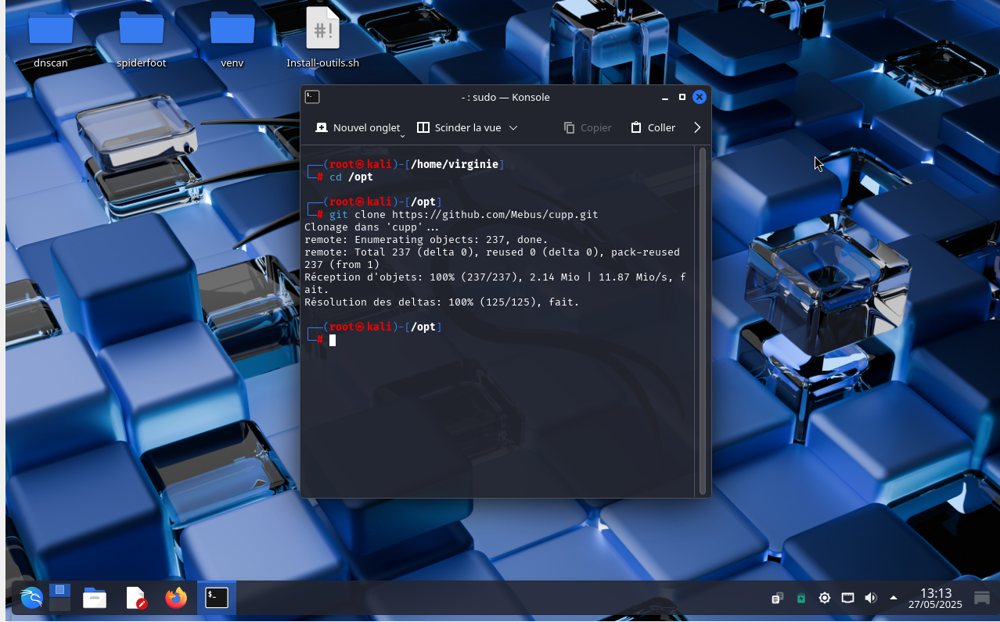
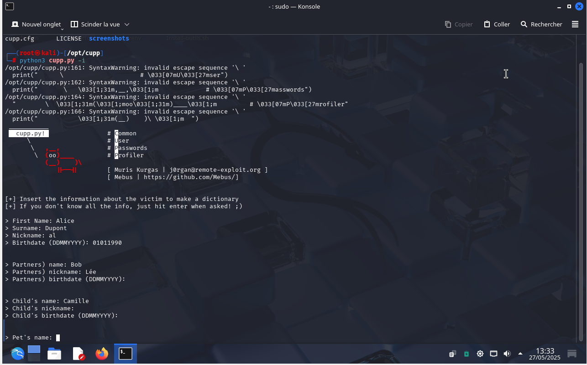
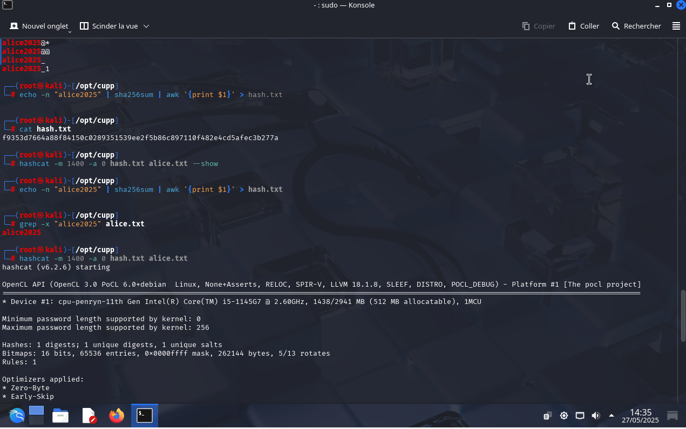
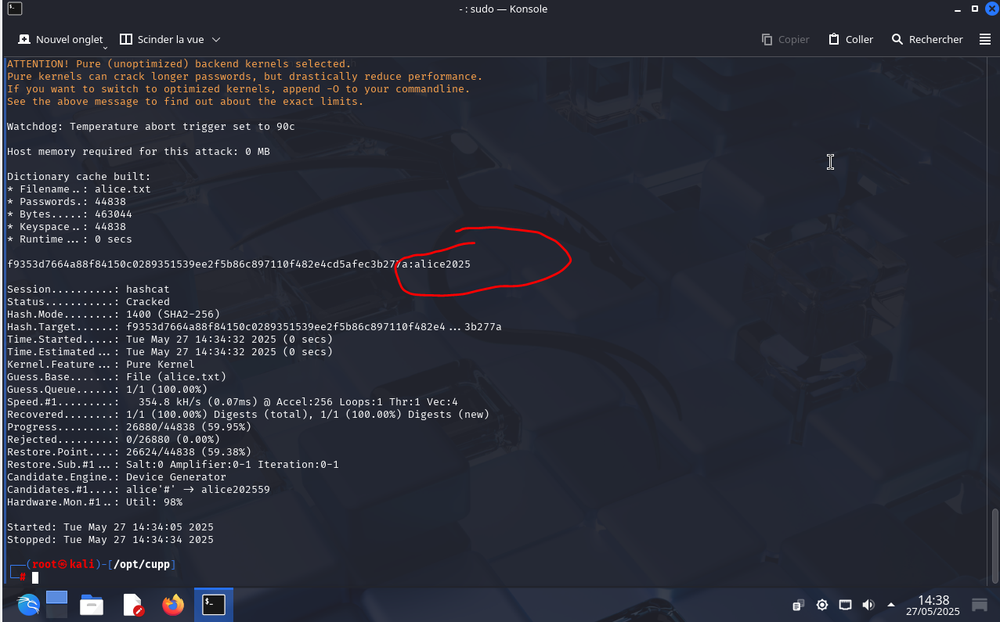

Brute Force — Exercice pédagogique

---

## Sommaire

- [Avertissement](#avertissement)
- [Objectif de l'exercice](#objectif-de-lexercice)
- [Outils utilisés](#outils-utilisés)
- [Étapes pas à pas](#étapes-pas-à-pas)
- [Créer un hash simulé](#créer-un-hash-simulé)
- [Vérifier si le mot est dans le dictionnaire](#vérifier-si-le-mot-est-dans-le-dictionnaire)
- [Casser le hash avec Hashcat](#casser-le-hash-avec-hashcat)
- [Remarque sur la difficulté réelle](#remarque-sur-la-difficulté-réelle)
- [Conclusion](#conclusion)
- [Licence](#licence)

---

## Avertissement

Ce projet est réalisé dans un cadre pédagogique.

Toutes les données utilisées sont fictives.

Il est strictement interdit de reproduire cette méthode sur des personnes réelles ou sans autorisation.

Ce projet a pour objectif de démontrer comment des informations simples, obtenues via l’OSINT, peuvent être utilisées pour générer des dictionnaires de mots de passe.

Ces dictionnaires sont ensuite testés avec Hashcat, dans un environnement local et sécurisé.

---

## **Objectif de l'exercice**

- Utiliser l'outil CUPP pour générer un fichier de mots de passe.

- Simuler un mot de passe réel (hash SHA-256).

- Utiliser Hashcat pour retrouver ce mot de passe à partir du dictionnaire généré.

---

## **Outils utilisés**

- Kali Linux (en VM)

- [CUPP](https://github.com/Mebus/cupp)

- Hashcat

- Terminal Bash

---

## Étapes pas à pas

 Cloner le dépôt CUPP

cd /opt

git clone https://github.com/Mebus/cupp.git

cd cupp

---

## Lancer le script pour générer un dictionnaire

python3 cupp.py -i

Répondre aux questions avec des données fictives :

First name: Alice

Surname: Dupont

Nickname: al

Birthdate: 01011990

Partner’s name: Bob

Child’s name: Camille

Pet’s name: Milou

Company: CyberSec

Puis :

Ajouter des mots-clés ? Oui → alice2025,password,cybersecurite,hacker

Ajouter caractères spéciaux ? Oui

Ajouter des chiffres aléatoires ? Oui

Mode leet ? Oui

Hyperspeed Print ? Non

Un fichier alice.txt est alors généré.

---

## Créer un hash simulé

echo -n "alice2025" | sha256sum | awk '{print $1}' > hash.txt

---

## Vérifier que le mot est dans le dictionnaire

grep alice2025 alice.txt

---

## Casser le hash avec Hashcat

hashcat -m 1400 -a 0 hash.txt alice.txt --show

- Résultat attendu :

f9335706... : alice2025

---

## Conclusion

Remarque importante sur la difficulté réelle

Cet exercice simplifie volontairement l’utilisation de Hashcat dans un environnement local et maîtrisé, avec des données fictives.

Dans un contexte réel, retrouver un mot de passe à l’aide d’un hash peut être extrêmement difficile, voire impossible, pour plusieurs raisons :

Longueur et complexité du mot de passe : plus un mot de passe est long et utilise des caractères variés (majuscules, minuscules, chiffres, caractères spéciaux), plus il est difficile à casser.

Algorithmes de hachage sécurisés : des fonctions comme bcrypt, scrypt ou argon2 sont conçues pour ralentir considérablement les attaques par force brute.

Puissance de calcul requise : casser un mot de passe fort peut demander des jours ou semaines de calcul avec des GPU haut de gamme.

Dictionnaire incomplet : si le mot de passe ne figure pas dans le dictionnaire généré, il ne pourra pas être retrouvé.

Protection contre les attaques : dans des environnements réels, les systèmes mettent souvent en place des protections contre les tentatives répétées.

Conclusion : cet exercice pédagogique montre une méthode en théorie, mais ne reflète pas la complexité réelle de casser des mots de passe modernes correctement protégés.

D’où l’importance :

De ne jamais utiliser d’informations personnelles pour ses mots de passe.

D’utiliser des gestionnaires de mots de passe robustes.

De sensibiliser à la sécurité numérique dès le plus jeune âge.

