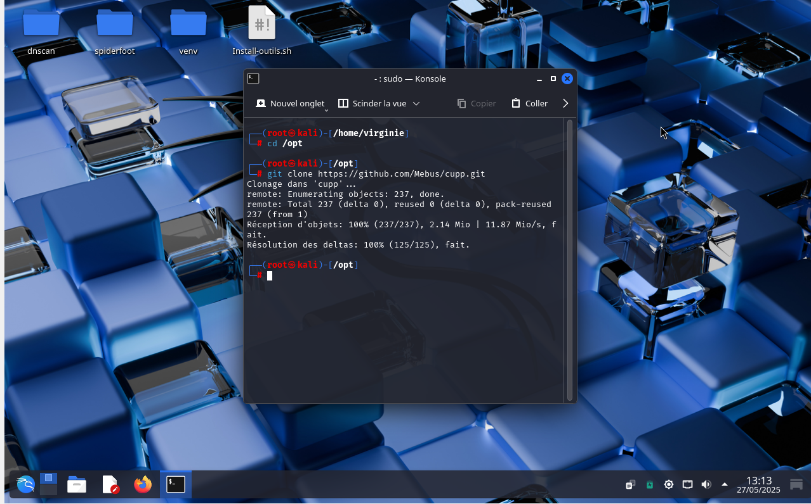
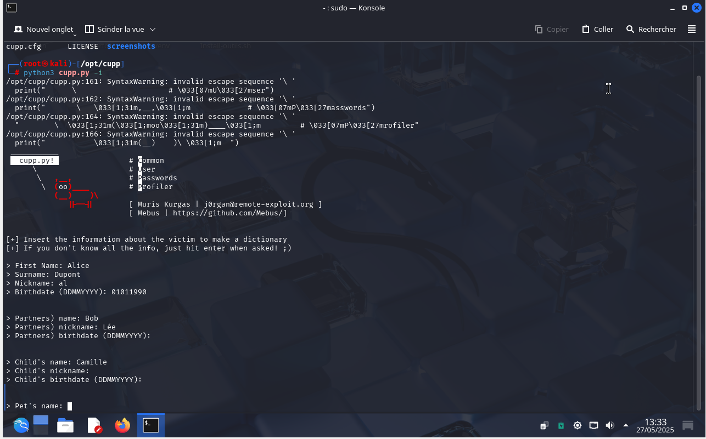
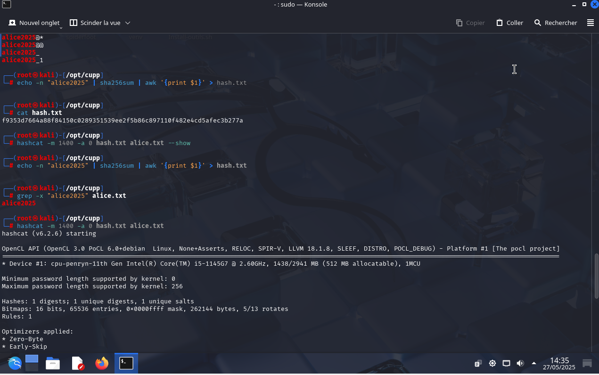
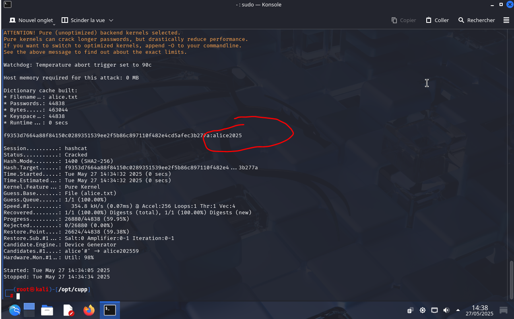

<h1 align="center">Brute Force & attaque par dictionnaire - Lab pédagogique</h1>

© 2025 Virginie Lechene 
<a href="https://creativecommons.org/licenses/by-nd/4.0/">CC BY-ND 4.0</a> 

---

## Sommaire

- [Avertissement](#avertissement)
- [Objectif de l'exercice](#objectif-de-lexercice)
- [Outils utilisés](#outils-utilisés)
- [Étapes pas à pas](#étapes-pas-à-pas)
- [Créer un hash simulé](#créer-un-hash-simulé)
- [Vérifier si le mot est dans le dictionnaire](#vérifier-si-le-mot-est-dans-le-dictionnaire)
- [Casser le hash avec Hashcat](#casser-le-hash-avec-hashcat)
- [Remarque sur la difficulté réelle](#remarque-sur-la-difficulté-réelle)
- [Conclusion](#conclusion)
- [Licence](#licence)

---

## Avertissement

Ce projet est réalisé dans un cadre pédagogique.

Toutes les données utilisées sont fictives.

Il est strictement interdit de reproduire cette méthode sur des personnes réelles ou sans autorisation.

Ce projet a pour objectif de démontrer comment des informations simples, obtenues via l’OSINT, peuvent être utilisées pour générer des dictionnaires de mots de passe.

Ces dictionnaires sont ensuite testés avec Hashcat, dans un environnement local et sécurisé.

---

## **Objectif de l'exercice**

- Générer un fichier de mots de passe personnalisé avec l’outil CUPP.
- Créer un hachage SHA-256 pour simuler un mot de passe réel.
- Utiliser Hashcat pour tester et retrouver ce mot de passe à partir du dictionnaire généré.

---

## **Outils utilisés**

- Kali Linux (en VM)

- [CUPP](https://github.com/Mebus/cupp)

- Hashcat

- Terminal Bash

---

## Étapes pas à pas

 Cloner le dépôt CUPP

cd /opt

git clone https://github.com/Mebus/cupp.git

cd cupp

---

## Lancer le script pour générer un dictionnaire

python3 cupp.py -i

Répondre aux questions avec des données fictives :

First name: Alice

Surname: Dupont

Nickname: al

Birthdate: 01011990

Partner’s name: Bob

Child’s name: Camille

Pet’s name: Milou

Company: CyberSec

Puis :

Ajouter des mots-clés ? Oui → alice2025, password, cybersecurite, hacker

Ajouter caractères spéciaux ? Oui

Ajouter des chiffres aléatoires ? Oui

Mode leet ? Oui

Hyperspeed Print ? Non

### 🔐 Génération des mots-clés personnalisés

Le script utilise les informations saisies par l’utilisateur (comme le prénom, surnom, date de naissance, etc.) pour générer automatiquement des mots-clés réalistes utilisés dans une wordlist.

Exemple :
Si l’utilisateur entre `al` comme surnom, le script peut générer `alice` à partir de cette base. Ensuite, il ajoute une année fréquemment utilisée (comme `2025`) pour créer un mot de passe potentiel : `alice2025`.

Ce type de mot-clé est ensuite ajouté à la wordlist avec d'autres variantes comme :
- `alice2025`
- `Alice@CyberSec`
- `Milou1990`
- `Camille0101!`
- `cYb3rS3c`

🎯 **But pédagogique :**
Montrer comment des données simples et accessibles peuvent être transformées en mots de passe prévisibles — comme le ferait un attaquant lors d'une attaque par force brute ciblée.

Un fichier `alice.txt` est généré automatiquement contenant toutes les combinaisons.

---

## Créer un hash simulé

echo -n "alice2025" | sha256sum | awk '{print $1}' > hash.txt

---

## Vérifier que le mot est dans le dictionnaire

grep alice2025 alice.txt

---

## Casser le hash avec Hashcat

hashcat -m 1400 -a 0 hash.txt alice.txt --show

- Résultat attendu :

f9335706... : alice2025

---

 ## Conclusion

⚠️

Ce projet a été conçu dans un but strictement pédagogique, en utilisant un environnement local, maîtrisé, et des données fictives. Il permet d’illustrer le fonctionnement fondamental des attaques par force brute à l’aide de l’outil Hashcat, dans un cadre simplifié.

Cependant, dans un contexte réel, la récupération d’un mot de passe à partir de son empreinte (hash) peut s’avérer extrêmement complexe, voire impossible, en raison de plusieurs facteurs :

Complexité des mots de passe : plus un mot de passe est long et contient une combinaison variée de caractères (lettres, chiffres, symboles), plus il est difficile à casser.

Algorithmes de hachage robustes : des fonctions telles que bcrypt, scrypt ou argon2 sont conçues pour rendre les attaques très coûteuses en temps et en ressources.

Puissance de calcul nécessaire : le cassage d’un mot de passe fort peut exiger des jours, voire des semaines de calcul intensif, même avec des GPU haut de gamme.

Limitations des dictionnaires : si le mot de passe n’est pas inclus dans le dictionnaire utilisé, il ne pourra pas être trouvé.

Contremesures techniques : les systèmes réels mettent souvent en place des protections contre les tentatives répétées (verrouillage de compte, délais progressifs, CAPTCHA, etc.).

🔐 Cependant, même un mot de passe long et complexe peut être compromis, notamment par des techniques telles que le phishing, l’installation de malwares, ou la fuite de bases de données.

C’est pourquoi il est essentiel d’activer l’authentification à deux facteurs (2FA), afin d’ajouter une couche supplémentaire de sécurité aux comptes sensibles.

✅ À retenir

Cet exercice illustre un mécanisme théorique, mais ne reflète pas la complexité des attaques menées dans des environnements modernes et correctement sécurisés. Il vise avant tout à sensibiliser aux enjeux liés à la sécurité des mots de passe et à encourager l’adoption de bonnes pratiques.

- Recommandations
Utilisez des mots de passe uniques, longs et complexes.

Activez systématiquement l’authentification à deux facteurs (2FA) lorsque cela est possible.

N’utilisez jamais d’informations personnelles dans vos mots de passe.

Utilisez un gestionnaire de mots de passe sécurisé pour créer et stocker vos identifiants.

Sensibilisez votre entourage à la sécurité numérique, dès le plus jeune âge.

---
 ## Licence

Le script est publié sous la licence **MIT**.

---

## À propos de l’usage

Ce projet est destiné **exclusivement à des fins pédagogiques**, notamment dans le cadre :
- d’une formation en cybersécurité,
- de tests d’intrusion légaux (pentest),
- d’analyses réseau dans un environnement contrôlé.

> L’auteure **ne cautionne ni n’autorise** l’utilisation de ce script en dehors d’un cadre légal strictement défini.
> Toute utilisation non conforme est interdite et relève **uniquement de la responsabilité de l’utilisateur**.

---

## 📷 Droits sur les visuels

Les visuels de ce dépôt sont protégés par la licence CC BY-ND 4.0.
Attribution obligatoire – Modification interdite.

© 2026 Virginie Lechene

---

