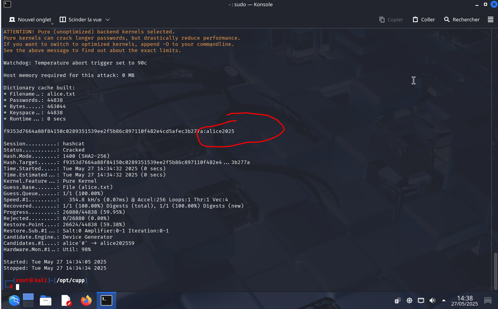

# Brute Force Exercise

© 2025 Virginie Lechene — License 
<a href="https://creativecommons.org/licenses/by-nd/4.0/">CC BY-ND 4.0</a> 

---

## ⚠️ Disclaimer

This project is intended strictly for educational purposes.

All data used is entirely fictitious.

Applying these methods to real individuals or systems without explicit authorization is strictly prohibited.

The goal of this project is to demonstrate how simple information gathered through OSINT can be used to generate custom password dictionaries.

These dictionaries are then tested using Hashcat in a secure, local environment.

---
## Table of Contents

- [Disclaimer](#disclaimer)
- [Exercise Objective](#exercise-objective)
- [Tools Used](#tools-used)
- [Step-by-Step Guide](#step-by-step-guide)
- [Create a Simulated Hash](#create-a-simulated-hash)
- [Check if the Password is in the Dictionary](#check-if-the-password-is-in-the-dictionary)
- [Crack the Hash with Hashcat](#crack-the-hash-with-hashcat)
- [Note on Real-World Difficulty](#note-on-real-world-difficulty)
- [Conclusion](#conclusion)
- [License](#license)

---

##  Exercise Objective

- Generate a custom password list using the CUPP tool.
- Create a SHA-256 hash to simulate a real password.
- Use Hashcat to test and crack the password from the generated dictionary.

---

## 🛠️ Tools Used

- Kali Linux (running in a virtual machine)
- [CUPP](https://github.com/Mebus/cupp)
- Hashcat
- Bash Terminal

---

## Step-by-step instructions

---

### Clone the CUPP repository

cd /opt
git clone https://github.com/Mebus/cupp.git
cd cupp

---

## 🛠️ Run the script to generate a dictionary

python3 cupp.py -i

First name: Alice
Surname: Dupont
Nickname: al
Birthdate: 01011990
Partner’s name: Bob
Child’s name: Camille
Pet’s name: Milou
Company: CyberSec
 

Then:

- Add keywords? → Yes → `alice2025, password, cybersecurity, hacker`
- Add special characters? → Yes
- Add random numbers? → Yes
- Leet mode? → Yes
- Hyperspeed Print? → No

A file named `alice.txt` will then be generated.

---

## 🔐 Create a simulated hash

echo -n "alice2025" | sha256sum | awk '{print $1}' > hash.txt

##  Check if the password is in the dictionary

grep alice2025 alice.txt

🔓 Crack the hash with Hashcat

hashcat -m 1400 -a 0 hash.txt alice.txt --show

Expected result:

f9335706... : alice2025

##  Conclusion

### Important Note on Real-World Difficulty

This exercise intentionally simplifies the use of Hashcat in a controlled and local environment using fictitious data.

In a real-world scenario, retrieving a password using a hash can be extremely difficult or even impossible for several reasons:

- **Password length and complexity**: The longer and more complex a password is (uppercase, lowercase, digits, special characters), the harder it is to crack.
- **Secure hashing algorithms**: Functions such as `bcrypt`, `scrypt`, or `argon2` are specifically designed to slow down brute-force attacks.
- **Required computing power**: Cracking a strong password can take days or even weeks of computation using high-end GPUs.
- **Incomplete dictionaries**: If the password is not included in the generated dictionary, it will not be found.
- **Attack protections**: In real systems, security measures are often in place to prevent repeated attempts.

### Final Word

This educational exercise demonstrates a theoretical method, but it does not reflect the actual complexity of cracking modern and properly protected passwords.

This is why it's important to:
- Avoid using personal information in your passwords.
- Use strong and secure password managers.
- Promote cybersecurity awareness from an early age.

---

## ⚠️ Legal Warning

This project is intended solely for educational purposes within the scope of cybersecurity training.
The author does not endorse or authorize the use of these techniques outside a clearly defined legal framework.
Any unauthorized use is strictly prohibited and remains the sole responsibility of the user.

---

## ✍ Author / Rights

### Visual Content Rights

All visuals, images, and illustrations in this repository are the exclusive property of the author.
Any reproduction, modification, or reuse without prior permission is strictly prohibited.

© 2025 Virginie Lechene – All rights reserved.
